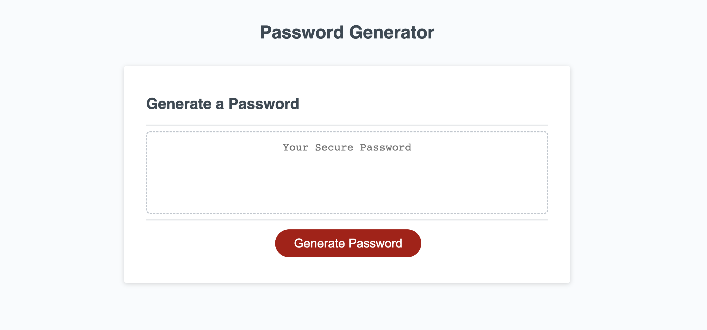
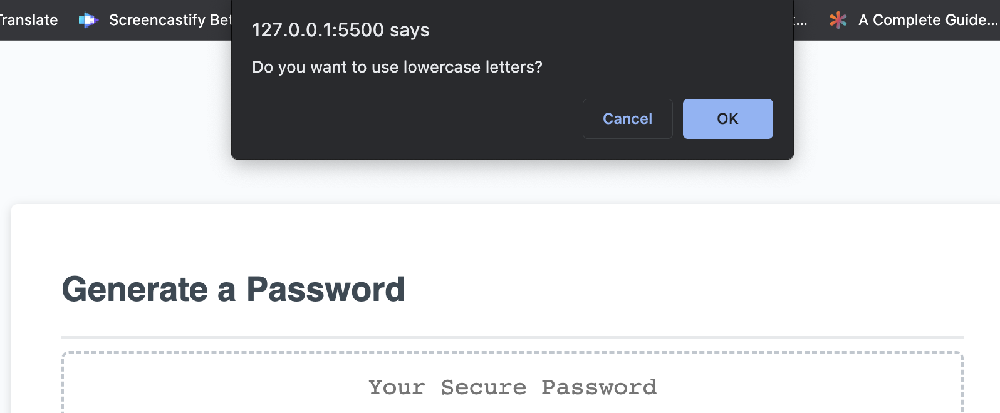
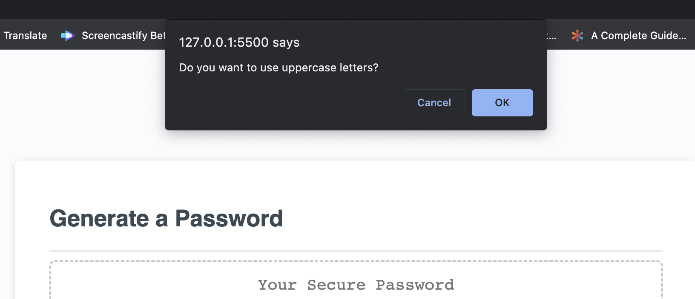
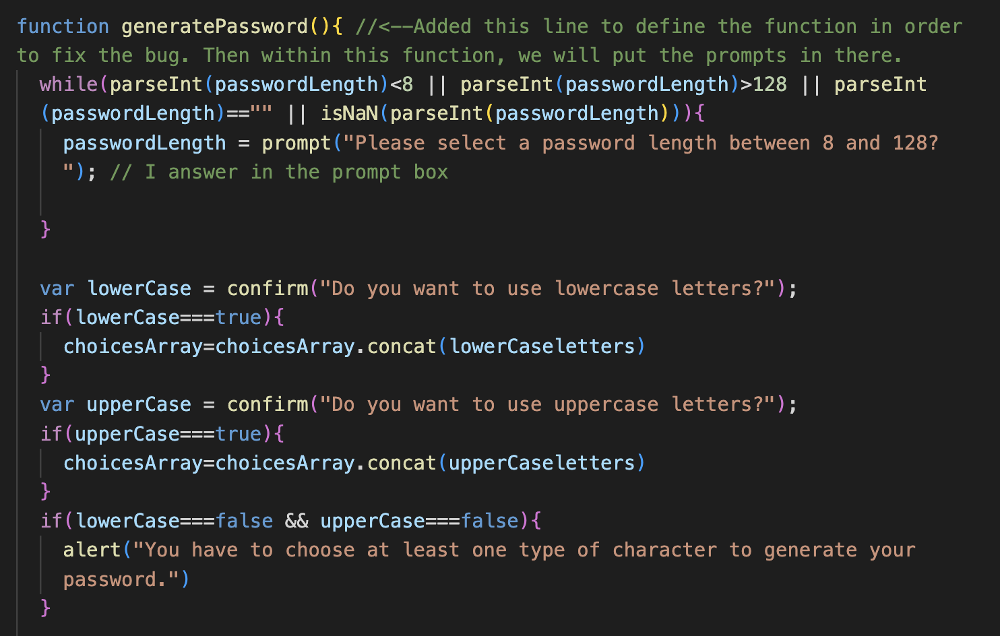

# Password Generator 

Welcome! Do you ever get set sick of thinking of new passwords? Or do you find yourself using the same password for all of your accounts? If either scenario sounds like you, then hopefully you'll find this password-generator helpful! 

[Deployed Website](https://amylipscomb.github.io/password-generator/)

<strong>My Task</strong>

Today, almost everything requires a password, and the purpose of this password generator is to create a random password. JavaScript was heavily utilized in this process. When people visit the site, they're asked a variety of questions, including how long they'd like their password to be, and if they wanted to use lower and/or uppercase letters. 

In order for these questions to appear, I had to use a combination of the prompt() and confirm() methods. The prompt method is used if a boolean response is wanted, meaning, a dialogue box will appear for someone to type something back as a response. Whereas, a confirm method provides two options- to either confirm or cancel. Below is a snippet of the coding. 

As you can see within the screenshot, I also had to include a parseInt method in addition to the prompt method. The reason why is because the prompt question asks for numbers within a specific range. The formula that was used, reads, "If the password length is less than 8 or greater than 128, then it will come back as NaN (not a number)". 

For the confirm questions, I inserted a "for...of" statement. This statement creates a loop that operates on a sequence of values sourced from an iterable object, which in this case is an array. Regarding the password generator, the confirm will be true if the user selects the "okay" button for either the lowercase or uppercase letters. However, if a user chooses not to select both, then an alert will pop up, telling the user that at least one type is required in order to generate a password.

Within the codes, I learned the importance of the following operators:

- && <-- "and"
- || <-- "or"
- === <-- "the most accurate true- true based on value and type" 
- == <-- "true based on value"

While working on the password generator, I made sure to save my work constantly, utilizing 'git push', and made sure that each time I made commits, each commit had descriptive messages. 

<strong>Technologies Used</strong>	

-	HTML 
-	CSS
-	VS Code
-   JavaScript

I hope you enjoyed viewing my password generator, and learning about the process behind the coding!
