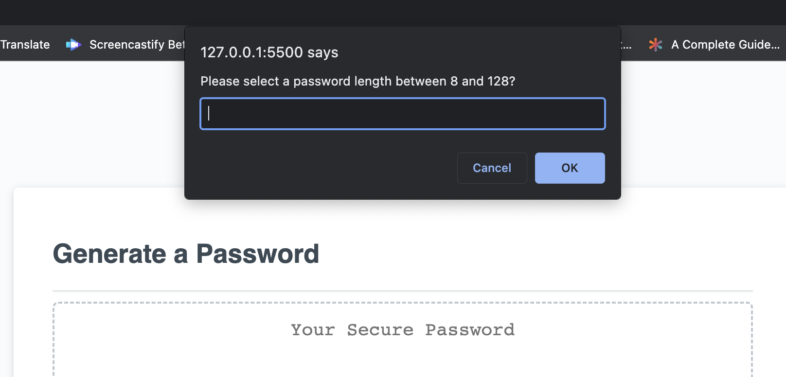

# Password Generator 

Welcome! Do you ever get set sick of thinking of new passwords? Or do you find yourself using the same password for all of your accounts? If either scenario sounds like you, then hopefully you'll find this password-generator helpful! 

[Deployed Website] 

<strong>My Task</strong>

Today, almost everything requires a password, and the purpose of this password generator is to create a random password. JavaScript was heavily utilized in this process. When people visit the site, they're asked a variety of questions, including how long they'd like their password to be, and if they wanted to use lower and/or uppercase letters. 

In order for these questions to appear, I had to use a combination of the prompt() and confirm() methods. The prompt method is used if a boolean response is wanted, meaning, a dialogue box will appear for someone to type something back as a response. Whereas, a confirm method provides a two options- to either confirm or cancel. Below is a snippet of the coding. 

As you can see within the screenshot, I also had to add a parseInt method in addition to the prompt method. This method makes so that ...

<strong>Technologies Used</strong>	

-	HTML 
-	CSS
-	VS Code
-   JavaScript

I hope you enjoyed viewing my password generator, and learning about the process behind the coding!
